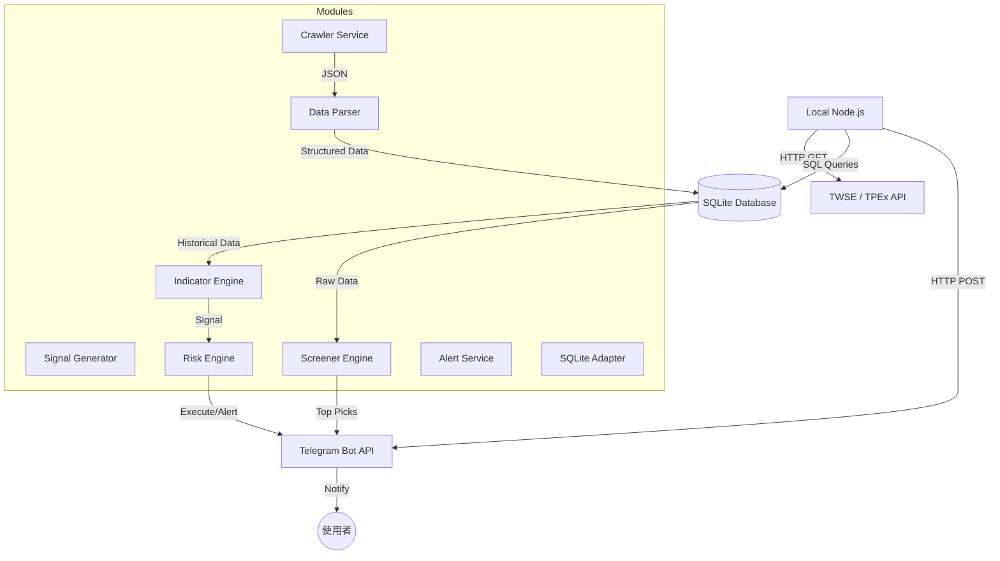

# System Architecture: 2026 股票操作

**Date:** 2026-02-08
**Architect:** Antigravity (Agent / BMAD Architect)
**Version:** 1.0
**Project Type:** 股市量化交易系統
**Project Level:** 2 (中型專案)
**Status:** Draft

---

## Executive Summary

本架構設計將採用 **Modular Monolith (模組化單體)** 模式，部署於 **本地 Node.js** 環境。系統將整合台灣證券交易所 (TWSE) 數據 API，並透過模組化設計實作數據抓取、指標運算、風控監測與 Telegram 實時通知。資料將儲存於 **SQLite** 資料庫檔。

---

## Architectural Drivers

1.  **NFR-001 (可靠性)**: 需穩定對接 TWSE API 並處理網路延遲或格式變動。
2.  **NFR-002 (可擴展性)**: 模組化設計以支援未來新增選股指標 (如 MACD, RSI)。
3.  **NFR-003 (安全性)**: 安全存儲 Telegram Token 與 API Key。
4.  **本地執行限制**: 需考慮單線程非同步處理，避免阻塞主執行緒。資料讀寫需考慮原子性。

---

## System Overview

### High-Level Architecture
系統由五大核心模組組成，並以 **SQLite** 作為輕量化且高效的關聯式資料庫。

### Architecture Diagram (Mermaid)

---

## Technology Stack

*   **平台**: Node.js (v18+)
*   **資料存儲**: SQLite3
*   **整合介面**: Telegram Bot API (HTTP POST)
*   **開發語言**: Javascript (CommonJS or ESM)
*   **核心套件**: `axios` (HTTP), `better-sqlite3` (SQLite 引擎), `dotenv` (環境變數)

---

## System Components

1.  **Crawler Service (資料爬蟲組件)**
    *   負責封裝 `axios` 請求。
    *   實作解析 TWSE/TPEx 價量、法人、資券與分點當沖資料。
    *   具備自動重試與速率限制 (Rate Limiting) 機制。
2.  **Indicator Engine (指標運算核心)**
    *   實例化 VAO 與 MTM 運算邏輯。
    *   儲存移動平均線 (MA) 等基礎數據。
3.  **Signal Generator (選股信號器)**
    *   比對運算結果與選股準則。
    *   產出「🔥強勢關注」名單。
4.  **Risk & Backtest Engine (風控與回測組件)**
    *   **風控**: 監測當前部位，判斷是否滿足停損/停利條件。
    *   **回測**: 載入歷史 Data Table 模擬策略執行，生成勝率報告。
5.  **Alerting Service (通訊服務模組)**
    *   封裝 Telegram 訊息格式。
    *   處理 API 傳送。

---

## Data Architecture

### Data Model (Google Sheets Schema)

| Table 名稱               | 說明                        |
| :----------------------- | :-------------------------- |
| **daily_prices**         | 每日收盤價、成交量歷史      |
| **institutional_trades** | 三大法人買賣超、資券餘額    |
| **indicators**           | 計算後的指標 (VAO, MTM, MA) |
| **positions**            | 目前持股、成本與停損設定    |
| **trades_history**       | 已實現交易紀錄 (供回測評估) |

---

## API Design

*   **Internal Interfaces**:
    *   `Crawler.fetchDaily(date)`
    *   `Indicator.calculate(symbol, data)`
    *   `Alert.sendToTelegram(message)`
*   **External Integrations**:
    *   Telegram Bot API (`sendMessage` endpoint).

---

## Non-Functional Requirements Coverage

*   **NFR-001 (可靠性)**: 使用 `CacheService` 避免重覆請求，減輕 API 負擔。
*   **NFR-003 (安全性)**: 使用 `dotenv` 儲存敏感 tokens，禁止明碼寫在代碼中。使用 `.gitignore` 排除環境檔案。

---

## Trade-offs & Decision Log

*   **Local Files vs Cloud DB**: 選擇本地檔案是為了極速開發與隱私，且易於備份。缺點是多設備同步較困難。
*   **Node.js vs GAS**: Node.js 擁有更強大的生態系 (npm) 與自定義執行環境，不受 GAS 的 6 分鐘限制。

---

## 相關文件
- **Previous:** 
  - [Product Brief](./product-brief-stock-2026.md) (Phase 1)
  - [PRD](./prd-stock-2026.md) (Phase 2)
- **Related:** [Screener Design](./screener-design-stock-2026.md) (Phase 3 - 選股系統詳設)
- **Next:** [Sprint Plan](./sprint-plan-stock-2026.md) (Phase 4 - 實作規劃)
- **總覽:** [Project Overview](./project-overview-stock-2026.md)

---

## Next Steps

1.  ✅ 已完成：驗證架構覆蓋 PRD 所有需求
2.  ✅ 已完成：詳細選股系統設計 ([Screener Design](./screener-design-stock-2026.md))
3.  🔄 進行中：**Phase 4: Implementation** - 開始實作 `Crawler Service`

---
**This document was created using BMAD Method v6 - Phase 3 (Solutioning)**

---

*Document Status: ✅ Complete | Cross-references updated 2026-02-08 by Zeda*
